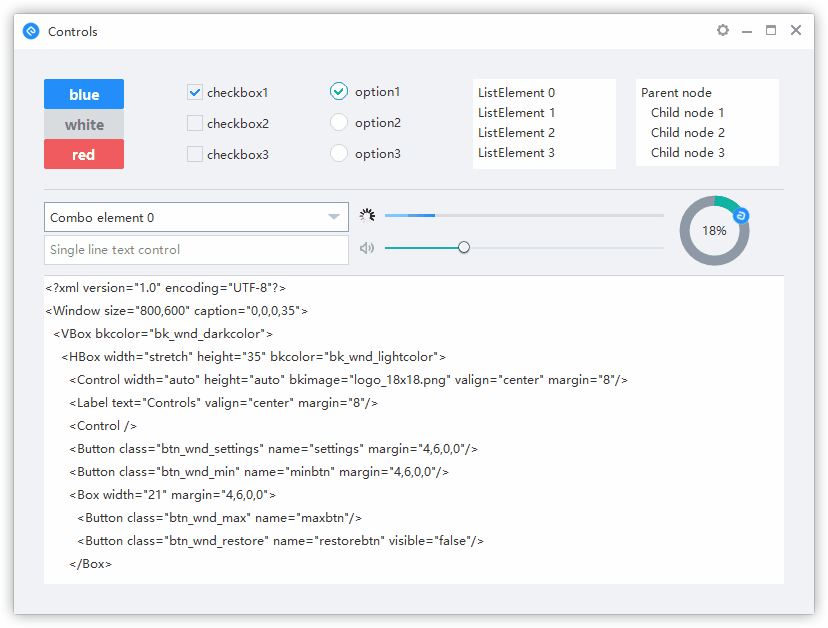

# NIM Duilib

NIM Duilib 包含了一整套桌面软件的开发部件，与其说这是一个界面库，不如说它是一个开发框架。从原有 Duilib 基础上拓展了一些新的能力，并整合了 Google base 基础类库（线程、内存、闭包等）。您完全可以直接使用这个框架来开发任何你想要的桌面应用。

修改说明：
1. 本分支对cef进行了升级，目前是libcef [chromium80,3987版本](http://opensource.spotify.com/cefbuilds/index.html)  
2. 并且添加了mp4的支持，可以在www.html5test.com验证，使用别人编译的库：https://download.csdn.net/download/ldmlrx/12285397  
3. 解决了multi_browser内存泄漏的问题（关闭1个tab，内存不释放，特别是如果这个tab里面包含视频的话，还会在后台播放😂）  
4. 解决了win7下最大最小化窗口，网页中还需要再点击一次才能滚动鼠标的问题  
5. 修正设置Control控件的bkcolor1，背景不渐变的问题
6. 增加教程说明：[解决网易开源duilib自带RichEdit在部分系统下键盘无法输入的问题](https://blog.csdn.net/xmcy001122/article/details/113343899)


[](https://ci.appveyor.com/project/nmgwddj/nim-duilib-framework)

[English](README_en-US.md)

## 特色

 - 多国语言支持
 - 通用样式支持
 - DPI 缩放支持
 - GIF 动画支持
 - CEF 控件支持（CEF 2623 支持 XP）
 - 触控设备支持（Surface、Wacom）
 - 抽象渲染接口（为其他渲染引擎提供支持）

## 预览



## 开始

克隆项目到你的磁盘中

```bash
git clone https://github.com/xmcy0011/NIM_Duilib_Framework
```

进入 `NIM_Duilib_Framework/examples` 目录，使用 Visual Studio 2017 以上版本 IDE 打开 `examples.sln`，按下 F7 即可编译所有示例程序

## 文档

 - [快速上手](docs/GETTING-STARTED.md)
 - [中文文档](docs/SUMMARY.md)

## 目录

├─`base` 基础类库  
├─`bin` 各个示例程序输出目录，包含预设的皮肤和语言文件以及 CEF 依赖  
├─`docs` duilib 接口的说明文档  
├─`duilib` duilib 核心代码，依赖 base 但不依赖 shared  
├─`libs` 静态库编译后的输出目录，包含预设的一些 CEF 组件静态库  
├─`examples` 各类示例程序源代码  
├─`third_party` 第三方库，目前仅有 cef_control 有依赖  
├─`ui_components` 基于 duilib 封装的常用组件库如 `msgbox`、`toast`、`cef_control` 等  

## 交流

 - 遇到问题：欢迎查看我们整理过的[中文文档](docs/SUMMARY.md)参考[示例程序](examples/README.md)来帮助你解决疑惑
 - 提交缺陷：在确保使用最新版本依然存在问题时请尽量以简洁的语言描述清楚复现该问题的步骤并提交 issue
 - 功能建议：如果你有什么好的想法或者提案，欢迎提交 issue 与我们交流
